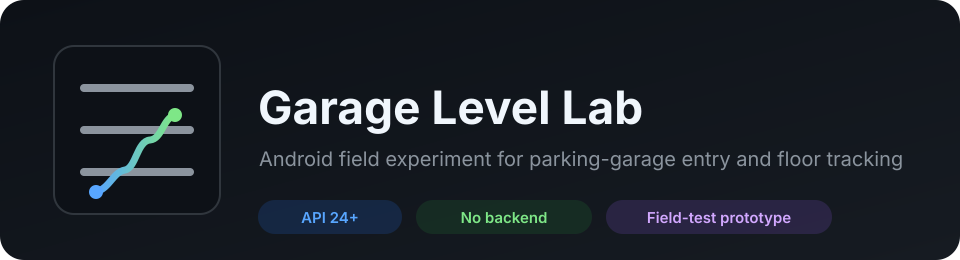
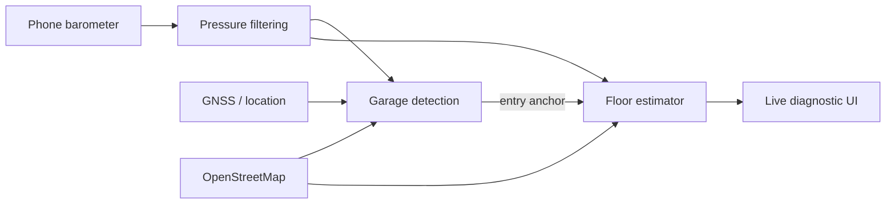

<p align="center">
  
</p>

<p align="center">
  <a href="https://github.com/Dborasik/garage-level-lab/actions"></a>
  
  
  <a href="LICENSE"></a>
</p>

**Garage Level Lab** is a small Android field experiment: can an ordinary phone detect that it entered a parking garage and keep track of which physical level it moved to?

This repository is **one test from a larger private research project**. It intentionally documents this experiment and its current implementation only.

## Current status

**Proof of concept — working, not validated broadly.**

The first uncontrolled real-world walking test used an ordinary phone in a multi-level garage:

- garage entry was detected;
- two successive upward floor changes were detected;
- the return trip down to the entry deck was tracked correctly;
- one transition below the entry deck was missed;
- the garage's signs call the street-entry deck **Level 3**, with lower levels below it, while public map metadata did not provide a reliable semantic entrance label.

That is a useful early result, but it is **one test**, not an accuracy claim. Vehicle tests and broader garage/device testing are still required. See [`docs/FIELD_NOTES.md`](docs/FIELD_NOTES.md) and [`docs/TESTING.md`](docs/TESTING.md).

## What it does

The app keeps a readable live diagnostic view while tracking:

- nearby mapped parking structures;
- garage-entry confidence and evidence;
- raw and filtered barometric pressure;
- relative altitude and vertical speed;
- estimated current level and confidence;
- GPS/GNSS accuracy, satellites and signal quality;
- speed and bearing;
- accelerometer and gyroscope values;
- map/topology data used by the estimate;
- recent estimator events.

Normal use requires **no manual calibration**. A manual re-anchor and floor-height override exist only for testing incomplete map data.

## How the experiment works

The prototype does not trust GPS altitude as a floor number. It combines several weak signals and constrains them with the structure it believes the device is inside.



At a high level:

1. Query nearby parking structures from OpenStreetMap through Overpass.
2. Watch map position, GNSS degradation and recent vertical movement for sustained garage-entry evidence.
3. Anchor filtered pressure near the detected entrance time.
4. Track **relative** pressure altitude from that anchor.
5. Compare the measured vertical displacement against physically valid mapped levels when such metadata exists.
6. Use transition priors and hysteresis so a noisy sample does not immediately move the estimate to another floor.

The current math and implementation are documented in [`docs/ALGORITHM.md`](docs/ALGORITHM.md). The research behind the experiment is summarized in [`docs/RESEARCH.md`](docs/RESEARCH.md).

## Why semantic floor labels are difficult

Physical movement and the label printed on a garage sign are separate problems.

A phone may correctly observe:

```text
entry deck  -> +1 floor -> +2 floors -> +1 floor -> entry deck
```

while the garage labels those same decks:

```text
Level 3     -> Level 4  -> Level 5   -> Level 4  -> Level 3
```

If the entrance's semantic level is missing or wrong in the map data, relative vertical tracking can still work while the displayed absolute label is offset. This is a known limitation of the current prototype rather than something pressure alone can determine.

## Device compatibility

The project targets **Android 7.0 / API 24 and newer**, including the original Samsung Galaxy S8.

For floor estimation, the device needs a pressure sensor (`TYPE_PRESSURE`). The app detects sensor availability at runtime. GPS/GNSS and precise location are also required for the intended garage-entry behavior.

No Google Play Services SDK, account, backend, analytics SDK or advertising SDK is required.

## Build

### Android Studio

Open the repository in Android Studio with:

- JDK 17
- Android SDK 35
- Android Gradle Plugin 8.7.3
- Gradle 8.9

Build the `app` module normally.

### Command line

If Gradle 8.9, JDK 17 and Android SDK 35 are installed:

```bash
gradle test lintDebug assembleDebug
```

For the platform-independent estimator checks:

```bash
./tools/run_core_self_tests.sh
```

CI runs the core tests, JVM tests, Android lint and debug APK assembly on every push and pull request.

## Using the prototype

1. Install a debug or release APK.
2. Enable precise location and network access.
3. Open the app while outside the garage.
4. Press **Start** before entering.
5. Keep the app running while moving through the structure.
6. Watch the garage/floor result and supporting diagnostics.
7. Press **Stop** when finished.

The app uses a visible foreground service while tracking. It does **not** request background-location permission.

## Privacy

The prototype is intentionally local-first:

- no account or device identity;
- no analytics or advertising SDKs;
- no persisted raw location/GNSS/IMU/pressure history;
- only user-selected settings are persisted;
- nearby coordinates are sent as a bounded geographic query to the public Overpass service to retrieve OpenStreetMap garage data.

See [`PRIVACY.md`](PRIVACY.md) for the exact data behavior.

## Known limitations

This is not a navigation or safety system. Current limitations include:

- incomplete or incorrect garage/floor metadata;
- unknown semantic entrance level;
- underground-entry/transition edge cases;
- split-level and continuously sloped garages;
- unusual floor heights;
- HVAC, cabin and weather pressure effects;
- poor/no connectivity before garage map data has been loaded;
- false similarities between unmapped garages, tunnels and covered roads;
- no useful floor estimate on devices without a barometer.

The UI exposes uncertainty instead of treating the estimate as ground truth.

## Repository map

```text
app/src/main/java/dev/radixen/garagelevel/
  TrackingService.java       Android sensor/location orchestration
  MainActivity.java          diagnostic interface
  estimator/                 filtering, garage detection, floor estimation
  data/                      OpenStreetMap / Overpass lookup
  model/                     garage and telemetry state
  util/                      geodesy, formatting, diagnostics

docs/
  RESEARCH.md                prior work and platform/map research
  ALGORITHM.md               current estimator and math
  ARCHITECTURE.md            implementation structure and data flow
  TESTING.md                 validation methodology
  FIELD_NOTES.md             real-world observations
```

## Contributing

Field-test reports and reproducible bug reports are useful. Please avoid posting private location history or other sensitive data.

Unsolicited code contributions are not currently accepted; see [`CONTRIBUTING.md`](CONTRIBUTING.md).

## License

This project is **source-available**, not OSI open source.

Noncommercial use, modification and redistribution are permitted under the **PolyForm Noncommercial License 1.0.0**. Commercial use requires separate permission from the copyright holder.

See [`LICENSE`](LICENSE) for the complete terms.

OpenStreetMap data remains under the ODbL and is not relicensed by this repository.
